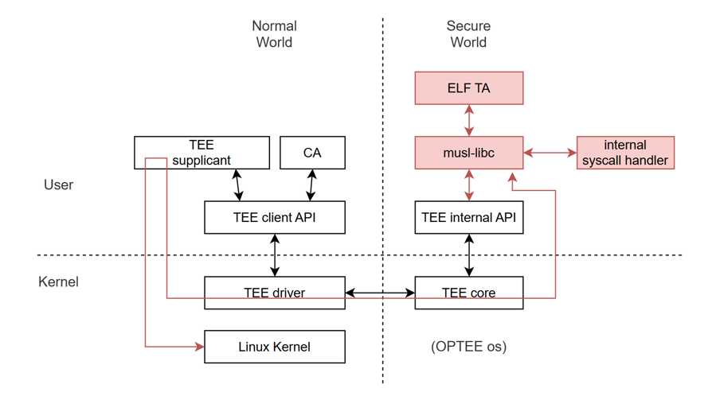
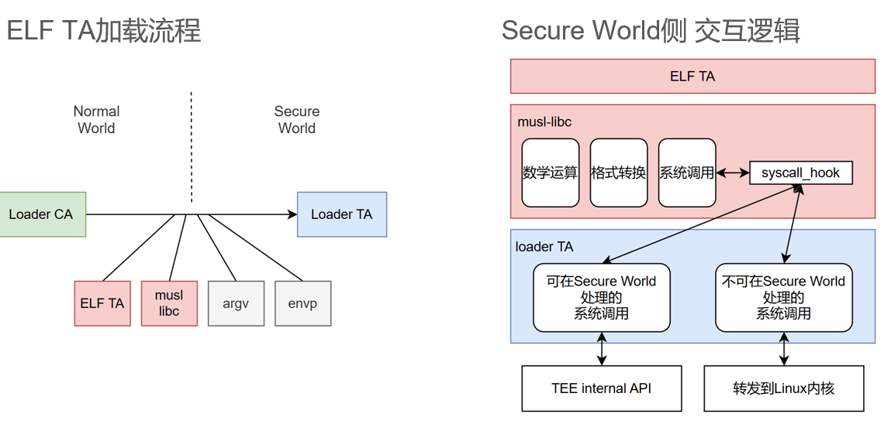
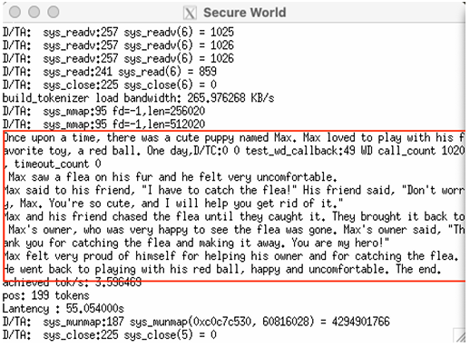
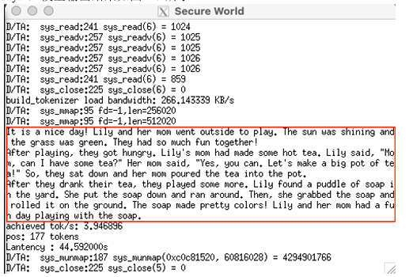
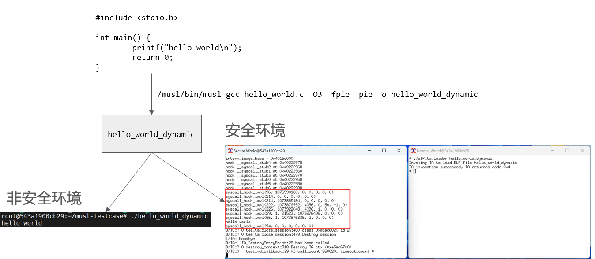
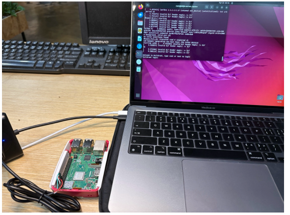

# Transparent ELF Rehosting for OP-TEE
## TL;DR
This project makes it possible to run an original C program, compiled into an ELF file under a normal Linux environment, directly inside OP-TEE without modification or with only very small changes, usually fewer than ten lines of code. Through OP-TEE, the entire execution process of the program can be protected.

## background
In modern computing, hardware-based Trusted Execution Environments (TEEs), such as OP-TEE built on ARM TrustZone, provide systems with isolated execution, confidentiality, and integrity protection.
However, programs running inside a TEE are usually specially developed Trusted Applications, rather than general ELF executables that users have already compiled in the Normal World. As a result, migrating an application into a TEE often requires major rewriting or a complete redesign for the TEE architecture. This greatly limits the use of TEE protection in the wider software ecosystem.

Based on this problem, I began to think: is it possible to let an ELF program originally compiled for the Normal World run inside OP-TEE with only minimal modification, by adding a proper runtime adaptation layer, and still gain the confidentiality and integrity protection provided by the TEE?

To achieve this, I proposed a new idea called a “universal TEE container.” In this design, a general ELF executable is treated as a protected container or Trusted Application that can run inside OP-TEE without requiring developers to rewrite their applications. The key is to adapt the runtime support library (such as musl-libc), modify the loading mechanism, and integrate TEE resources and isolation features. With these changes, an existing ELF executable, such as one generated from llama2.c, can successfully run in the Secure World.

## Technical Details
In this project, I made systematic modifications to **musl-libc**. During the compilation stage, I replaced all system call symbols with null pointer slots. This keeps the system call positions in the generated ELF file open for delayed binding.

Inside **OP-TEE**, I built a **secure rebinding layer**. After the ELF file is loaded, this layer dynamically resolves and fills in the system call addresses. System calls that can be safely handled inside the Secure World are processed locally. For system calls that cannot be safely executed or need access to REE (Normal World) resources, they are securely delegated to the REE through a controlled communication channel.

At the same time, I reproduced and preserved musl’s startup sequence, including environment setup, entry point initialization, and stack/heap preparation. The modified musl itself runs as a **Trusted Application (TA)** inside the Secure World. It is responsible for booting and running the target ELF file. This allows complex user-space programs to fully start and execute inside the TEE.

Using this method, I successfully migrated and protected the execution of a more complex **llama2** program inside OP-TEE, as demonstrated in the open-source project **llama2-optee**.



## Results






Test on RPI 3B+

|Evaluation Metrics|REE|TEE|
|:---:|:---:|:---:|
|Tokenizer Memory Loading Bandwidth (KB/s)|9853.49291|196.066726|
|Model Parameter Memory Loading Bandwidth (MB/s)|28999.341965|21.299553|
|**Model Throughput (tokens/s)**|5.262455|5.425647|
|**Inference Latency (s)**|34.563|38.553|
|**Number of Tokens**|183|212|

This approach even improved the runtime efficiency of **llama2.c** inside the TEE!

# Another Part
This research also resulted in a patent. Due to practical considerations, the contents covered by the patent are not open-sourced for now. You can learn about this part of the work through the patent document included in [this repository](https://github.com/TephrocactusMYC/OTEC).

# How to use
**Update**: It is currently confirmed that this code can run stably on version 4.2.0, but there are many issues with version 4.4.0.

Many thanks to [@Jian Zhaolong](https://github.com/JolyonJian) for his help， [here](./doc/run.md) is a more detailed documentation for using the code.


## details

**Adjust the paths according to your own setup**

### Configure musl

Compile the *llama2.c* program using the modified **musl-libc**.

```
# set musl-libc
cd elf-musl-libc
./configure --target=aarch64 --prefix=/musl CROSS_COMPILE=/optee/toolchains/aarch64/bin/aarch64-linux-gnu-
```
compile llama2.c, especially run.c
```
/musl/bin/musl-gcc run.c -O3 -fpie -pie -o run
```
For now, you need to change the path inside *llama2.c* to an absolute path.
```
cd llama2.c 
vim run.c
```
Modify the following content.
```C
char *tokenizer_path = "/root/tokenizer.bin"; // depends on real file path inside REE
```
### Compile OP-TEE

Follow the [OP-TEE documentation for building on QEMUv8](https://optee.readthedocs.io/en/latest/building/devices/qemu.html#qemu-v8).

If using Docker, you can use the Dockerfile below directly, or install the packages listed below.
```
FROM ubuntu:22.04
ARG DEBIAN_FRONTEND=noninteractive
RUN apt update && apt upgrade -y
RUN apt install -y \
    adb \
    acpica-tools \
    autoconf \
    automake \
    bc \
    bison \
    build-essential \
    ccache \
    cpio \
    cscope \
    curl \
    device-tree-compiler \
    e2tools \
    expect \
    fastboot \
    flex \
    ftp-upload \
    gdisk \
    git \
    libattr1-dev \
    libcap-ng-dev \
    libfdt-dev \
    libftdi-dev \
    libglib2.0-dev \
    libgmp3-dev \
    libhidapi-dev \
    libmpc-dev \
    libncurses5-dev \
    libpixman-1-dev \
    libslirp-dev \
    libssl-dev \
    libtool \
    libusb-1.0-0-dev \
    make \
    mtools \
    netcat \
    ninja-build \
    python3-cryptography \
    python3-pip \
    python3-pyelftools \
    python3-serial \
    python-is-python3 \
    rsync \
    swig \
    unzip \
    uuid-dev \
    wget \
    xdg-utils \
    xterm \
    xz-utils \
    zlib1g-dev
RUN curl https://storage.googleapis.com/git-repo-downloads/repo > /bin/repo && chmod a+x /bin/repo
RUN mkdir /optee
WORKDIR /optee
RUN repo init -u https://github.com/OP-TEE/manifest.git -m qemu_v8.xml && repo sync -j10
WORKDIR /optee/build
RUN make -j2 toolchains
RUN make -j$(nproc) check
```
If you are using Docker on Windows, you can use X11 forwarding:
```
export DISPLAY=192.168.191.100:0.0
```
Open the terminal. If you are using a virtual machine, you can ignore this step.
### Modify QEMU Secure Memory Size
First, go to the root directory of **/optee**.
Inside the **QEMU** folder, modify the address range.
```
diff --git a/hw/arm/virt.c b/hw/arm/virt.c
index 7d9dbc2..fde5b6a 100644
--- a/hw/arm/virt.c
+++ b/hw/arm/virt.c
@@ -158,12 +158,14 @@ static const MemMapEntry base_memmap[] = {
     [VIRT_MMIO] =               { 0x0a000000, 0x00000200 },
     /* ...repeating for a total of NUM_VIRTIO_TRANSPORTS, each of that size */
     [VIRT_PLATFORM_BUS] =       { 0x0c000000, 0x02000000 },
-    [VIRT_SECURE_MEM] =         { 0x0e000000, 0x01000000 },
+    // [VIRT_SECURE_MEM] =         { 0x0e000000, 0x01000000 },
+    [VIRT_SECURE_MEM] =         { 0x40000000, 0x08000000 },
     [VIRT_PCIE_MMIO] =          { 0x10000000, 0x2eff0000 },
     [VIRT_PCIE_PIO] =           { 0x3eff0000, 0x00010000 },
     [VIRT_PCIE_ECAM] =          { 0x3f000000, 0x01000000 },
     /* Actual RAM size depends on initial RAM and device memory settings */
-    [VIRT_MEM] =                { GiB, LEGACY_RAMLIMIT_BYTES },
+    // [VIRT_MEM] =                { GiB, LEGACY_RAMLIMIT_BYTES },
+    [VIRT_MEM] =                { 0x48000000, LEGACY_RAMLIMIT_BYTES-0x08000000 },
 };
```
in u-boot folder
```
diff --git a/board/emulation/qemu-arm/qemu-arm.c b/board/emulation/qemu-arm/qemu-arm.c
index 34ed3e8a..8aaae101 100644
--- a/board/emulation/qemu-arm/qemu-arm.c
+++ b/board/emulation/qemu-arm/qemu-arm.c
@@ -71,8 +71,10 @@ static struct mm_region qemu_arm64_mem_map[] = {
                         PTE_BLOCK_PXN | PTE_BLOCK_UXN
        }, {
                /* RAM */
-               .virt = 0x40000000UL,
-               .phys = 0x40000000UL,
+               /*.virt = 0x40000000UL,
+               .phys = 0x40000000UL,*/
+               .virt = 0x48000000UL,
+               .phys = 0x48000000UL,
                .size = 255UL * SZ_1G,
                .attrs = PTE_BLOCK_MEMTYPE(MT_NORMAL) |
                         PTE_BLOCK_INNER_SHARE
diff --git a/board/emulation/qemu-arm/qemu-arm.env b/board/emulation/qemu-arm/qemu-arm.env
index e658d5ee..19c318a6 100644
--- a/board/emulation/qemu-arm/qemu-arm.env
+++ b/board/emulation/qemu-arm/qemu-arm.env
@@ -4,9 +4,14 @@
 
 fdt_high=0xffffffff
 initrd_high=0xffffffff
-fdt_addr=0x40000000
+/*fdt_addr=0x40000000
 scriptaddr=0x40200000
 pxefile_addr_r=0x40300000
 kernel_addr_r=0x40400000
-ramdisk_addr_r=0x44000000
+ramdisk_addr_r=0x44000000*/
+fdt_addr=0x48000000
+scriptaddr=0x48200000
+pxefile_addr_r=0x48300000
+kernel_addr_r=0x48400000
+ramdisk_addr_r=0x4C000000
 boot_targets=qfw usb scsi virtio nvme dhcp
diff --git a/configs/qemu_arm64_defconfig b/configs/qemu_arm64_defconfig
index 94bd9667..e2a2dffd 100644
--- a/configs/qemu_arm64_defconfig
+++ b/configs/qemu_arm64_defconfig
@@ -4,14 +4,14 @@ CONFIG_ARCH_QEMU=y
 CONFIG_SYS_MALLOC_LEN=0x1000000
 CONFIG_NR_DRAM_BANKS=1
 CONFIG_HAS_CUSTOM_SYS_INIT_SP_ADDR=y
-CONFIG_CUSTOM_SYS_INIT_SP_ADDR=0x40200000
+CONFIG_CUSTOM_SYS_INIT_SP_ADDR=0x48200000
 CONFIG_ENV_SIZE=0x40000
 CONFIG_ENV_SECT_SIZE=0x40000
 CONFIG_DEFAULT_DEVICE_TREE="qemu-arm64"
 CONFIG_DEBUG_UART_BASE=0x9000000
 CONFIG_DEBUG_UART_CLOCK=0
 CONFIG_ARMV8_CRYPTO=y
-CONFIG_SYS_LOAD_ADDR=0x40200000
+CONFIG_SYS_LOAD_ADDR=0x48200000
 CONFIG_ENV_ADDR=0x4000000
 CONFIG_PCI=y
 CONFIG_DEBUG_UART=y
diff --git a/configs/qemu_arm_defconfig b/configs/qemu_arm_defconfig
index 7cb1e9f0..67d254c9 100644
--- a/configs/qemu_arm_defconfig
+++ b/configs/qemu_arm_defconfig
@@ -4,7 +4,7 @@ CONFIG_ARCH_QEMU=y
 CONFIG_SYS_MALLOC_LEN=0x1000000
 CONFIG_NR_DRAM_BANKS=1
 CONFIG_HAS_CUSTOM_SYS_INIT_SP_ADDR=y
-CONFIG_CUSTOM_SYS_INIT_SP_ADDR=0x40200000
+CONFIG_CUSTOM_SYS_INIT_SP_ADDR=0x48200000
 CONFIG_ENV_SIZE=0x40000
 CONFIG_ENV_SECT_SIZE=0x40000
 CONFIG_DEFAULT_DEVICE_TREE="qemu-arm"
@@ -12,7 +12,7 @@ CONFIG_TARGET_QEMU_ARM_32BIT=y
 CONFIG_DEBUG_UART_BASE=0x9000000
 CONFIG_DEBUG_UART_CLOCK=0
 CONFIG_ARMV7_LPAE=y
-CONFIG_SYS_LOAD_ADDR=0x40200000
+CONFIG_SYS_LOAD_ADDR=0x48200000
 CONFIG_ENV_ADDR=0x4000000
 CONFIG_PCI=y
 CONFIG_DEBUG_UART=y
diff --git a/include/configs/qemu-arm.h b/include/configs/qemu-arm.h
index e296f398..cbe612b2 100644
--- a/include/configs/qemu-arm.h
+++ b/include/configs/qemu-arm.h
@@ -7,8 +7,8 @@
 #define __CONFIG_H
 
 /* Physical memory map */
-#define CFG_SYS_SDRAM_BASE             0x40000000
-
+/*#define CFG_SYS_SDRAM_BASE           0x40000000*/
+#define CFG_SYS_SDRAM_BASE             0x48000000
 /* For timer, QEMU emulates an ARMv7/ARMv8 architected timer */
 
 #endif /* __CONFIG_H */
```
在trusted-firmware-a/plat/qemu/qemu/include/platform_def.h文件夹之中
```
diff --git a/plat/qemu/qemu/include/platform_def.h b/plat/qemu/qemu/include/platform_def.h
index 903c809..1121cd1 100644
--- a/plat/qemu/qemu/include/platform_def.h
+++ b/plat/qemu/qemu/include/platform_def.h
@@ -79,14 +79,19 @@
 #define SEC_ROM_BASE                   0x00000000
 #define SEC_ROM_SIZE                   0x00020000
 
-#define NS_DRAM0_BASE                  ULL(0x40000000)
-#define NS_DRAM0_SIZE                  ULL(0xc0000000)
-
-#define SEC_SRAM_BASE                  0x0e000000
+//#define NS_DRAM0_BASE                        ULL(0x40000000)
+//#define NS_DRAM0_SIZE                        ULL(0xc0000000)
+#define NS_DRAM0_BASE                   ULL(0x48000000)
+#define NS_DRAM0_SIZE                   ULL(0xB8000000)
+
+//#define SEC_SRAM_BASE                        0x0e000000
+//#define SEC_SRAM_SIZE                        0x00100000
+#define SEC_SRAM_BASE                  0x40000000
 #define SEC_SRAM_SIZE                  0x00100000
-
-#define SEC_DRAM_BASE                  0x0e100000
-#define SEC_DRAM_SIZE                  0x00f00000
+//#define SEC_DRAM_BASE                        0x0e100000
+//#define SEC_DRAM_SIZE                        0x00f00000
+#define SEC_DRAM_BASE                  0x40100000
+#define SEC_DRAM_SIZE                  0x07f00000
 
 #define SECURE_GPIO_BASE               0x090b0000
 #define SECURE_GPIO_SIZE               0x00001000
```
### Using the Code from This Project

Replace the folders **elf-optee-client**, **elf-optee-os**, **elf-optee-test**, and **elf-build** into the **/optee** directory from the previous step, following the official documentation (replace folders with the same names).

Add the **`elf-ta`** folder to the **`/optee_examples`** directory, and then run the compilation process again.

```
make run -j
```

Compiling work Finished.

### Running the Program

Place the parameters, vocabulary files, and the compiled ELF file of *llama2.c* into the REE-side filesystem home directory under **out-br**:

```
/optee/out-br/target/root
```

Then run:

```
elf_ta_loader ./run /root/stories15M.bin
# The parameter path may need to be modified
```

### Sharing Folders Between QEMU and Host

If you do not want to copy or modify files each time QEMU starts, you can enable a shared folder between QEMU and the host. Steps:

```
# During compilation
make QEMU_VIRTFS_ENABLE=y QEMU_USERNET_ENABLE=y run-only
```

Then, in the REE-side terminal that appears, run:

```
mkdir -p /mnt/host
mount -t 9p -o trans=virtio host /mnt/host
cd /mnt/host/loader_test/
```

Finally, run the command:

```
elf_ta_loader ./run /mnt/host/loader_test/stories15M.bin
```

TEE-side output:


### Running on Raspberry Pi

The compilation process is similar to QEMU. See the [official documentation](https://optee.readthedocs.io/en/latest/building/devices/rpi3.html) for details.

Note that the OP-TEE project optimizes compilation options in the Raspberry Pi makefile, so files copied into **out-br** may have their symbol tables stripped.

Therefore, you need to keep libc.so, ELF, and other files beforehand. After copying the image to the SD card, copy these files to the SD card. Alternatively, you can use the official internal network transfer protocol (similar to QEMU shared folders).

To modify the secure memory size on Raspberry Pi, edit the file **plat-rpi3/conf.mk**.


# origin repository
[This](https://github.com/TephrocactusMYC/llama2-optee) is the original repository used for internal collaboration. It is unorganized, but you may be able to find more details.
